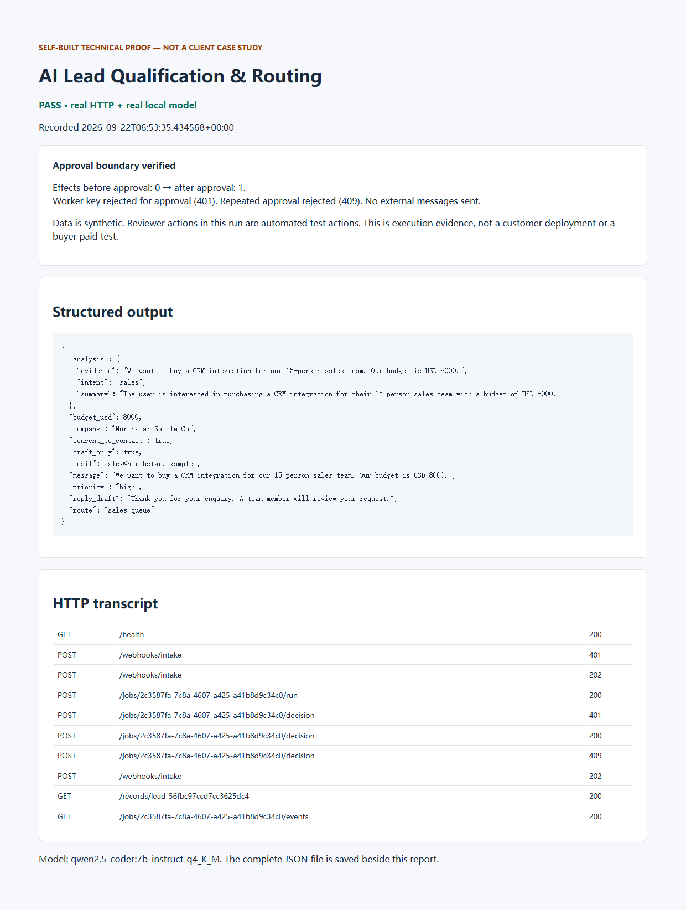

# Three-minute technical proof review

**SELF-BUILT TECHNICAL PROOF — NOT A CLIENT CASE STUDY**

[GitHub repository](https://github.com/yeqingdeng23-boop/ai-lead-qualification-routing) · [18 passing CI tests](https://github.com/yeqingdeng23-boop/ai-lead-qualification-routing/actions/runs/35704295373)

## 0:00–0:30 — The problem and scope

A purchase enquiry needs structured qualification, routing and a reviewable response draft, without allowing an AI or background worker to approve its own action.

This Codex-assisted personal project runs a real Python/FastAPI webhook and durable SQLite workflow with local Ollama inference. It uses synthetic data. The final CRM record is local SQLite; no external CRM integration or outbound email is claimed. This is an executable equivalent workflow, not an n8n deployment.

## 0:30–1:20 — Inspect the recorded execution

Open [the recorded HTTP run and structured JSON](evidence/live-run.json). The synthetic enquiry becomes `intent: sales`, `priority: high` and `route: sales-queue`, with a draft-only reply. The transcript contains real HTTP responses, model provenance and source hashes.

## 1:20–2:00 — Follow the architecture

[View the architecture diagram](README.md#architecture): authenticated webhook → validation/idempotency → durable queue → local model → schema and policy checks → separate approval → atomic local CRM write. Bounded retries and an event log support investigation.

## 2:00–2:40 — One error-handling case

In the same run, the worker's OPERATOR key attempts `POST /jobs/{id}/decision` and receives **401**. It cannot authorize its own CRM write. The run records **0 effects before approval** and **1 effect after the separate APPROVAL key is used**. Inspect `steps`, `effects_before_approval` and `effects_after_approval` in the JSON.

The authorized reviewer action in this recording is automated test orchestration, not a real person's approval. The [interactive instructions](README.md#run-and-inspect) let a reviewer make that decision manually.

## 2:40–3:00 — Reproduce and evaluate

Follow [installation and run commands](README.md#run-and-inspect); run `python -m pytest -q` for deterministic tests and `python scripts/demo.py` for live local-model execution. The model download and hardware requirements are documented there.

The code, tests and documentation were produced with Codex assistance. No commercial delivery, independent coding history, certification, production integration or revenue is claimed. A scoped paid technical assessment should establish suitability for actual work.

Supplementary evidence only: [Email/PDF Intake](https://github.com/yeqingdeng23-boop/email-pdf-intake-extraction) and [CRM Missed-Lead Recovery](https://github.com/yeqingdeng23-boop/crm-missed-lead-recovery).
